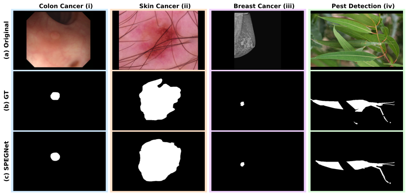

# SPEGNet: Synergistic Perception-Guided Network for Camouflaged Object Detection

[](https://github.com/Baber-Jan/SPEGNet)
[](LICENSE)
[](https://www.python.org/)
[](https://pytorch.org/)

> **Synergistic Perception-Guided Network for Camouflaged Object Detection** > [Baber Jan](mailto:baberjan008@gmail.com)<sup>1,2</sup>, [Saeed Anwar](mailto:saeed.anwar@uwa.edu.au)<sup>3</sup>, [Aiman H. El-Maleh](mailto:aimane@kfupm.edu.sa)<sup>1</sup>, [Abdul Jabbar Siddiqui](mailto:abduljabbar.siddiqui@kfupm.edu.sa)<sup>1</sup>, [Abdul Bais](mailto:Abdul.Bais@uregina.ca)<sup>4</sup> > <sup>1</sup>King Fahd University of Petroleum and Minerals
> <sup>2</sup>SDAIA-KFUPM Joint Research Center for Artificial Intelligence
> <sup>3</sup>University of Western Australia
> <sup>4</sup>University of Regina
>
> _Under Review at IEEE Transactions on Image Processing_

---

## Overview

Camouflaged object detection segments objects with intrinsic similarity and edge disruption. Current detection methods rely on accumulated complex components. Each approach adds boundary modules, attention mechanisms, and multi-scale processors independently. This accumulation creates computational burden without proportional gains. To manage complexity, methods process at reduced resolutions, eliminating fine details essential for camouflage. SPEGNet addresses fragmentation through synergistic design where complementary components work in concert. The architecture integrates multi-scale features via channel calibration and spatial enhancement. Boundaries emerge directly from context-rich representations, maintaining semantic-spatial alignment. Progressive refinement implements scale-adaptive edge modulation with peak influence at intermediate resolutions.

### Key Contributions

- **Synergistic architecture** achieving state-of-the-art COD performance without modular accumulation. Excels at intricate details, small and large pattern-similar objects, multiple instances, occlusions, and ambiguous boundaries.

- **Channel recalibration with spatial pooling** in a single module that amplifies object features while suppressing similar background patterns.

- **Direct boundary extraction** from contextual features preserving semantic meaning. Edges know what object they belong to, preventing false boundaries in textured regions.

- **Non-monotonic edge influence** (20%→33%→0%) across decoder stages. Peak influence at middle resolution captures camouflage boundaries most effectively.

---

## Architecture

<p align="center">
  
  <br>
  <em>SPEGNet architecture with data flow through four components: Feature Encoding, Contextual Feature Integration, Edge Feature Extraction, and Progressive Edge-guided Decoder with scale-adaptive modulation</em>
</p>

SPEGNet processes camouflaged images through synergistic modules. A hierarchical vision transformer encoder transforms input into multi-scale features. Three complementary modules then process these features:

1. **Contextual Feature Integration (CFI)**: Addresses intrinsic similarity through integrated channel-spatial processing. Performs channel recalibration to identify discriminative features, then applies spatial enhancement to capture multi-scale patterns.

2. **Edge Feature Extraction (EFE)**: Derives boundary information directly from context-enhanced features. Maintains semantic understanding throughout edge extraction, ensuring boundaries align with actual objects rather than texture patterns.

3. **Progressive Edge-guided Decoder (PED)**: Implements three-stage refinement with scale-adaptive edge modulation. Stage 1 establishes object localization with 20% edge influence. Stage 2 maximizes boundary precision with 33% edge influence. Stage 3 ensures region consistency with 0% edge influence.

---

## Performance

| Dataset | S<sub>α</sub> ↑ | F<sub>β</sub><sup>w</sup> ↑ | F<sub>β</sub><sup>m</sup> ↑ | E<sub>φ</sub> ↑ | MAE ↓ |
| ------- | --------------- | --------------------------- | --------------------------- | --------------- | ----- |
| CAMO    | 0.887           | 0.870                       | 0.882                       | 0.943           | 0.037 |
| COD10K  | 0.890           | 0.839                       | 0.847                       | 0.949           | 0.020 |
| NC4K    | 0.895           | 0.860                       | 0.870                       | 0.947           | 0.025 |

**Inference Speed**: 16.5ms per image (60+ FPS) with effective scaling to high resolutions

### Qualitative Results

<p align="center">
  
  <br>
  <em>Visual comparison on challenging scenarios. Columns: (a) input, (b) ground truth, (c-h) competing methods, (i) SPEGNet. Rows demonstrate: (i) small object detection, (ii) large object with pattern similarity, (iii) multiple instances, (iv) occlusion handling, (v) ambiguous boundaries. SPEGNet consistently outperforms across all scenarios.</em>
</p>

---

## Applications Beyond COD

<p align="center">
  
  <br>
  <em>SPEGNet generalizes to medical imaging and agricultural applications</em>
</p>

SPEGNet's synergistic design generalizes to related domains without modifications:

### Medical Imaging

- **Polyp Detection**: Kvasir, CVC-Clinic, ColonDB, CVC300, ETIS datasets
- **Skin Lesion Segmentation**: ISIC, PH2, HAM10K datasets
- **Breast Lesion Detection**: BCSD, DMID datasets

### Agricultural Applications

- **Pest Detection**: Locust-mini dataset for insects with natural camouflage

---

## Getting Started

### Prerequisites

SPEGNet requires the following environment:

- Python 3.10
- CUDA 11.8 with compatible GPU (Tested on NVIDIA H100)
- Anaconda or Miniconda for environment management

### Installation

1. Clone the repository:

```bash
git clone https://github.com/Baber-Jan/SPEGNet.git
cd SPEGNet
```

2. Run the setup script which handles all environment setup and validation:

```bash
chmod +x setup/setup.sh
./setup/setup.sh
```

The setup script performs several key tasks:

- Creates the conda environment with required dependencies
- Validates dataset organization if present
- Generates edge maps for CAMO dataset if needed
- Verifies system requirements

Alternatively, you can manually create the environment:

```bash
conda env create -f setup/environment.yml
conda activate spegnet
```

---

## Project Structure

```
SPEGNet/
├── configs/
│   └── default.yaml              # Training configuration
├── datasets/                     # Dataset directory
├── checkpoints/                  # Model weights
├── models/
│   ├── spegnet.py               # Main SPEGNet model
│   ├── feature_encoding.py      # Hiera encoder wrapper
│   ├── feature_integration.py   # CFI module
│   └── object_detection.py      # EFE and PED modules
├── utils/
│   ├── data_loader.py           # Dataset loading
│   ├── loss_functions.py        # Multi-scale loss
│   ├── metrics.py               # Evaluation metrics
│   └── visualization.py         # Result visualization
├── engine/
│   ├── trainer.py               # Training engine
│   ├── evaluator.py             # Evaluation engine
│   └── predictor.py             # Prediction engine
├── setup/
│   ├── environment.yml          # Conda environment
│   └── setup.sh                 # Setup script
└── main.py                      # Entry point
```

---

## Dataset Preparation

Download our COD datasets package containing CAMO, COD10K, and NC4K:

- **[Download Datasets (Google Drive)](https://drive.google.com/file/d/1GsEmE8820oOnSa_efqAzRX_8wL3Ha8ll/view?usp=sharing)** (~2.19GB)

After downloading, extract the datasets to the `datasets/` folder in your SPEGNet root directory (as shown in Project Structure above):

```bash
unzip datasets.zip -d SPEGNet/
```

Expected directory structure:

```
SPEGNet/
├── configs/
├── datasets/                    # Extract datasets here
│   ├── CAMO/
│   │   ├── train/
│   │   │   ├── Imgs/           # Training images
│   │   │   ├── GT/             # Ground truth masks
│   │   │   └── Edges/          # Edge maps (auto-generated)
│   │   └── test/
│   │       ├── Imgs/
│   │       └── GT/
│   ├── COD10K/
│   │   ├── train/
│   │   │   ├── Imgs/
│   │   │   ├── GT/
│   │   │   └── Edges/
│   │   └── test/
│   │       ├── Imgs/
│   │       └── GT/
│   └── NC4K/
│       └── test/
│           ├── Imgs/
│           └── GT/
├── checkpoints/
└── ...
```

---

## Pre-trained Models

### Download Links

- **SAM2.1 Hiera-Large Encoder** (Required for training only): [Download from Meta AI](https://dl.fbaipublicfiles.com/segment_anything_2/092824/sam2.1_hiera_large.pt) (~897MB)

  After downloading, place in the `checkpoints/` folder:

  ```
  SPEGNet/
  ├── configs/
  ├── checkpoints/               # Place encoder weights here
  │   └── sam2.1_hiera_large.pt
  ├── datasets/
  └── ...
  ```

- **SPEGNet Model Checkpoint**: [Google Drive](https://drive.google.com/file/d/10vPF0EuBlymTnS06pdR48GuoCsJlicuo/view?usp=sharing) (~2.6GB)

  - Trained SPEGNet model for evaluation/inference
  - Place in: `checkpoints/model_best.pth`

- **Test Set Predictions**: [Google Drive](https://drive.google.com/file/d/1boGfiB1ggwuN3oeu0cOSYarJuaNcFcF0/view?usp=sharing) (~76MB)
  - Contains segmentation outputs for CAMO-test, COD10K-test, and NC4K datasets

---

## Usage

### Configuration

All training configurations are specified in `configs/default.yaml` - review and modify hyperparameters, loss weights, and model settings as needed.

### Training

Train SPEGNet on COD10K + CAMO:

```bash
python main.py train --config configs/default.yaml
```

Training features:

- Automatic mixed precision (AMP) for efficient GPU utilization
- Multi-scale supervision with edge guidance
- Regular checkpointing and validation
- Early stopping with configurable patience

### Evaluation

Evaluate on test datasets:

```bash
python main.py evaluate --model checkpoints/model_best.pth
```

Evaluation provides:

- Standard COD metrics (S<sub>α</sub>, F<sub>β</sub><sup>w</sup>, MAE, E<sub>φ</sub>, F<sub>β</sub><sup>m</sup>)
- Quality-based result categorization
- Per-dataset performance analysis

### Prediction

For inference on new images:

```bash
python main.py predict \
    --model checkpoints/model_best.pth \
    --input path/to/image
```

The prediction outputs include:

- Binary segmentation mask
- Confidence heatmap
- Edge map
- Original image overlay

---

## Hardware Requirements

SPEGNet has been tested on:

- NVIDIA H100 GPU with 93.6GB VRAM (optimal setup)
- CUDA 11.8 with PyTorch 2.1.0
- 64 CPU cores for efficient preprocessing
- 193GB system RAM for optimal batch processing

The model supports various GPU configurations through adjustable batch sizes and memory optimization settings.

---

## Citation

If you find SPEGNet useful in your research, please cite:

```bibtex
@article{jan2024spegnet,
  title={SPEGNet: Synergistic Perception-Guided Network for Camouflaged Object Detection},
  author={Jan, Baber and Anwar, Saeed and El-Maleh, Aiman H. and Siddiqui, Abdul Jabbar and Bais, Abdul},
  journal={IEEE Transactions on Image Processing},
  year={2024},
  note={Under review}
}
```

---

## Acknowledgments

This research was conducted at the SDAIA-KFUPM Joint Research Center for Artificial Intelligence, King Fahd University of Petroleum and Minerals. We gratefully acknowledge:

- King Fahd University of Petroleum and Minerals (KFUPM) for institutional support
- SDAIA-KFUPM Joint Research Center for Artificial Intelligence (JRCAI) for computational resources
- Meta AI for providing the SAM2.1 foundation model
- [PySODMetrics](https://github.com/lartpang/PySODMetrics) for evaluation framework
- Authors of COD benchmark datasets (CAMO, COD10K, NC4K)

---

## License

This project is licensed under the MIT License - see [LICENSE](LICENSE) for details.

### Usage Terms

- Open source for research and non-commercial use
- Commercial use requires explicit permission
- Attribution required when using or adapting the code

The benchmark datasets (CAMO, COD10K, NC4K) maintain their original licenses. Please refer to their respective papers for terms of use.

---

## Contact

For questions or issues:

- **GitHub Issues**: [Create an issue](https://github.com/Baber-Jan/SPEGNet/issues)
- **Email**: baberjan008@gmail.com
- **Research Collaborations**: Contact Baber Jan at baberjan008@gmail.com

---

## Updates

- **2025-01**: Initial release with IEEE TIP submission
